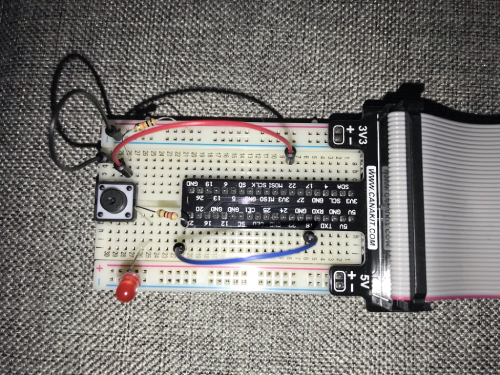

# Smart Lighting App

Smart Lighting App is an IoT app designed to control home lighting from multiple inputs. The app provides several methods for switching on/off lighting, through manual and automated processes. The app runs on a Raspberry Pi and for prototyping purposes, an LED will be used to simulate the lighting.

Four methods the LED can be switched on/off:

- Tactile on/off button
- Virtual on/off button (hosted on Flask server)
- LED switches on/off in accordance with sunset/sunrise
- MQTT Protocol

#### Tactile button:

A tactile button is wired up to the Raspberry Pi. When the button is pressed, the state of the LED is changed through `button.py`.

#### Virtual button:

A Flask server running on the Raspberry Pi hosts `index.html` which contains a light bulb image. When the image is clicked on, AJAX routes to `led_toggle` which sends a HTTP POST request to change the state of the LED.

#### Sunset/Sunrise:

The time of the sunrise and sunset are found using [Sunwait](https://github.com/risacher/sunwait). Cron jobs are used to monitor when the sun has risen or set.

crontab entries:
```
*/5 * * * * sunwait sun up 51.886661N 8.618732W ; python /home/pi/development/smart-lighting-app/light_on.py
*/5 * * * * sunwait sun down 51.886661N 8.618732W ; python /home/pi/development/smart-lighting-app/light_off.py
```

#### MQTT:

An MQTT broker can be used to change the state of the LED.

With `led_sub.py` running on the Pi, an MQTT payload can be published from any device with an  `ON` or `OFF` message. The MQTT broker sends this to the subscriber (the Pi) which in turn switches the LED on/off.

## Technologies

- Raspberry Pi 3 Model B+, LED, tactile button
- HTTP, MQTT
- Flask
- [Sunwait](https://github.com/risacher/sunwait)
- HTML, CSS, AJAX, Python
- Cron

## Usage

(Note: Aside from the cronjob for changing the LED state, the other three methods must be run independently and do not function simultaneously.)

Ensure the  Pi circuit is wired correctly:
-  Button is wired to **pin 22**
-  LED is wired to **pin 18**



```
# Clone the repository:
$ git clone https://github.com/TonyN96/smart-lighting-app.git

# Go into the repository
cd smart-lighting-app
```

##### Tactile button:

Run the `button.py` file
```
python button.py
```

##### Virtual button:

Run the `app.py` file to run the Flask server
```
python app.py
```
Visit `localhost:4000`

##### MQTT:

Run `led_sub.py` file with your MQTT broker URL

```
python led_sub.py mqtt://broker.hivemq.com:1883/YOUR_ID/home
```

Publish to the MQTT broker with `ON` or `OFF` as message payload. This can be done from another device, or `led_pub.py` can be used in a new terminal. Replace URL with your broker URL and replace `MESSAGE` with `ON` or `OFF`.

```
python leb_pub.py mqtt://broker.hivemq.com:1883/YOUR_ID/home MESSAGE
```